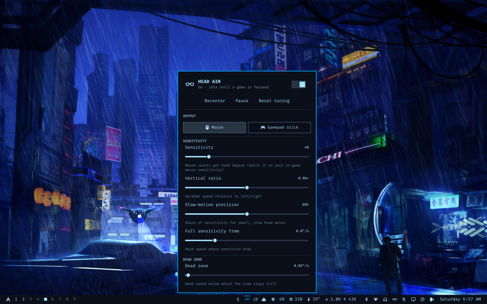
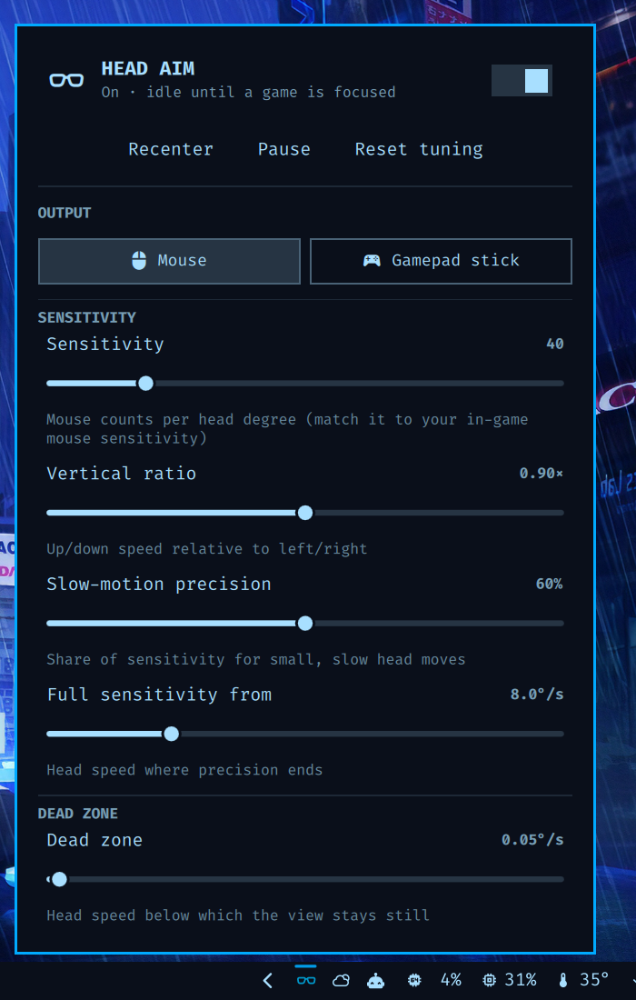

# XR Head Aim

Aim in games by turning your head with XR glasses. Head aim adds to your mouse or controller; it doesn't replace them.

An [Omarchy](https://omarchy.org) bar widget with a small background service. It reads your glasses' head tracking through [XRLinuxDriver](https://github.com/wheaney/XRLinuxDriver) and turns head movement into mouse movement or your controller's right stick. It only does this while a game window has focus. Optionally it also makes a PS5 DualSense work as an Xbox controller in every game, with no other tools needed.



## What it does

- **Low lag.** The glasses' IMU is read directly at about 115 Hz, with no generic smoothing filter. On fast moves the head speed is estimated from the latest three samples, so the aim follows the current motion rather than motion from half a sample ago. Output is written as soon as a sample arrives.
- **Accurate mouse mode.** Mouse movement is exactly head movement × sensitivity. Fractions of a count carry over, so nothing is lost or added. It works in almost any mouse-aim game.
- **Your PS5 controller's right stick (optional).** With the controller bridge, a DualSense (USB or Bluetooth) shows up in every game as a plain Xbox 360 pad, and head aim is mixed into its real right stick, so the stick and your head work together. Rumble works, and the pad survives Bluetooth drops mid-game. When no controller is connected, head aim moves the mouse instead (**Auto** output, the default).
- **Virtual pad mode (without the controller bridge).** This creates a separate virtual Xbox-style pad and drives its right stick. It is linear in turn rate and skips the game's stick dead zone, the way Steam Input's "gyro to joystick camera" does.
- **Holds still when you do.** A small dead zone and tremor smoothing apply only to very slow, near-still motion, so real turns get no added lag. A precision curve makes slow, small head moves finer.
- **Only in games.** By default it only acts while a Steam game window (`steam_app_*`) has focus, so it never moves your desktop pointer. You can add other window classes or exclude specific games.
- **Live tuning from the bar.** Turn it on or off, pick the output mode, and adjust sensitivity, vertical ratio, precision, dead zone, smoothing and lag removal. Changes apply instantly.



## Requirements

- Omarchy (Hyprland + the Omarchy shell)
- XR glasses supported by [XRLinuxDriver](https://github.com/wheaney/XRLinuxDriver#supported-devices) (VITURE, XREAL, Rokid, RayNeo). It has been tested on a **VITURE Luma Pro**; other glasses should work the same way but haven't been tested.
- `python3` and `python-evdev` (`sudo pacman -S python-evdev`)
- Optional: a PS5 DualSense or DualSense Edge (USB or Bluetooth) for the controller bridge

## Install

1. **Install [XRLinuxDriver](https://github.com/wheaney/XRLinuxDriver)** and plug in your glasses once, so it creates `~/.config/xr_driver/config.ini`. No other tracking software is needed: head tracking comes from the glasses' own IMU.

2. **Add the plugin and run its setup:**

   ```bash
   omarchy plugin add https://github.com/R88800/xr-head-aim --enable
   ~/.config/omarchy/plugins/io.github.r88800.xr-head-aim/install.sh
   ```

   The installer checks the dependencies and then:
   - asks before switching XRLinuxDriver to stream head poses (two lines in `config.ini`: `output_mode=external_only` stops the driver's own mouse movement, which would fight this plugin; the old file is kept as `config.ini.before-xr-head-aim`)
   - adds a udev rule for `/dev/uinput` only if you can't already write to it (Steam's rule usually covers this)
   - asks whether to set up the **controller bridge** for a PS5 controller (step 3)
   - writes `~/.config/xr-head-aim/settings.json` and installs a systemd **user** service

   Options: `--autostart` starts head aim at every login; `--controller` / `--no-controller` answer the controller question up front. Rerunning the installer is safe, and is how you update the controller bridge after `omarchy plugin update`.

3. **Optional, PS5 controller bridge.** Your DualSense then shows up in every game as a plain Xbox 360 pad whenever it connects (USB or Bluetooth): Xbox button layout (Cross = A, Circle = B, Square = X, Triangle = Y), analog triggers and rumble, and the pad survives Bluetooth drops mid-game. Head aim is mixed into its real right stick, so your thumb and your head work together. This part needs `sudo` once: it installs a small system service (`xr-pad.service`, which runs as root to read the controller) and a udev rule that hides the DualSense's own device from games, so they see exactly one controller.
   - Don't use it together with InputPlumber or another tool that remaps the DualSense (the installer warns if InputPlumber is running).
   - `uninstall.sh` removes the bridge and makes the controller visible to games directly again.

## Use

- **Bar icon:** left-click opens the panel, middle-click turns head aim on or off, right-click recenters.
- **Panel:** an on/off switch, Recenter, Pause and Reset tuning buttons, the output, and the sliders. Changes apply instantly.
- **Command line:** `bin/xr-head-aim start|stop|toggle|recenter|pause|state|tune key=value…|tune reset`. Bind it to keys if you like, e.g. in Hyprland: `bind = ALT, E, exec, ~/.config/omarchy/plugins/io.github.r88800.xr-head-aim/bin/xr-head-aim toggle`.

### Output

| Panel button | Setting | Where head aim goes |
|---|---|---|
| **Controller** / **Auto** | `output=auto` (default) | The controller's right stick while the bridge reports a connected controller, otherwise the mouse. Switches by itself when you connect or disconnect the controller. |
| **Mouse** | `output=mouse` | Always the mouse. |
| **Virtual pad** | `output=gamepad` | A separate virtual pad's right stick. Only offered without the controller bridge: next to a real controller, games would pick the wrong (empty) pad. |

### Tuning tips

- **Mouse:** set *Mouse sensitivity* (counts per head degree) so a head turn feels right with your in-game mouse sensitivity.
- **Controller stick:** set *Stick sensitivity* (view degrees per head degree). Set the game's look acceleration to 0, and *Game stick dead zone* to the game's look dead zone. `game_full_rate` / `game_full_rate_y` (the game's turn speed at full stick, deg/s) are in `settings.json`.
- **If the view drifts while you hold still:** raise *Dead zone*.
- **If small moves feel twitchy:** lower *Slow-motion precision* or raise *Tremor smoothing*.
- **To let a game through the focus check:** if it isn't a Steam window, add its class to `extra_classes`. To keep head aim out of a game (say, one that never aims with the right stick), add it to `excluded_classes`. Find a class with `hyprctl activewindow`.

### Troubleshooting

- **Panel says "waiting for glasses":** plug in the glasses and give XRLinuxDriver a few seconds to calibrate; check `systemctl --user status xr-driver`.
- **A game gets no controller input:** it probably grabbed a different controller while starting. Make sure only one Xbox pad exists (the panel's output should be *Controller*, not *Virtual pad*), then restart the game.
- **Steam shows two controllers:** check `systemctl status xr-pad` and that no other controller remapper (InputPlumber, ds4drv…) is running. Reconnecting the controller reapplies the udev rule.
- **Controller bridge log:** `journalctl -u xr-pad -f` shows connects and disconnects.

## Uninstall

```bash
~/.config/omarchy/plugins/io.github.r88800.xr-head-aim/uninstall.sh   # add --purge to also delete settings
omarchy plugin remove io.github.r88800.xr-head-aim
```

This removes the services and udev rules it added, including the controller bridge.

## How it works

XRLinuxDriver sends one UDP datagram per head pose to `127.0.0.1:<port>`. Each datagram holds six doubles (x, y, z, yaw, pitch, roll) followed by a frame counter. `xr_head_aim.py` turns the change in angle into a head speed, using time steps from the frame counter so network jitter adds no noise. It then shapes that speed (dead zone, tremor smoothing, precision curve, lag removal) and sends it to the controller bridge (when a controller is connected), a virtual uinput mouse or a virtual gamepad. The bar widget talks to the service through `bin/xr-head-aim`.

The controller bridge (`controller/xr_pad.py`, installed to `/usr/local/lib/xr-head-aim/`) grabs the DualSense's input devices and mirrors them onto a virtual "Microsoft X-Box 360 pad" with the same identity as a wired Xbox 360 controller. It receives head aim from the user service on `/run/xr-pad/head.sock` and blends it as `physical + head × (1 − |physical|)`, forwards rumble from games, and keeps the virtual pad for 10 minutes after a disconnect so a running game keeps its controller. `/run/xr-pad/state` tells the user service whether a controller is connected.

Run the tests with `python3 -m unittest test_xr_head_aim`. They need no glasses, controller, uinput or Hyprland.

## Built with Claude

This plugin was built by Riley together with [Claude Code](https://claude.com/claude-code), Anthropic's AI coding assistant. The aiming algorithm was tuned against recorded play sessions on a VITURE Luma Pro, and Claude wrote and tested the code with Riley's direction and in-game feedback. Please review it as you would any community code before installing.

## Contributing

Issues and pull requests are welcome from anyone. See [CONTRIBUTING.md](CONTRIBUTING.md).

## License

MIT. See [LICENSE](LICENSE). XRLinuxDriver and the glasses' SDKs are separate projects with their own licenses and are not included here.
